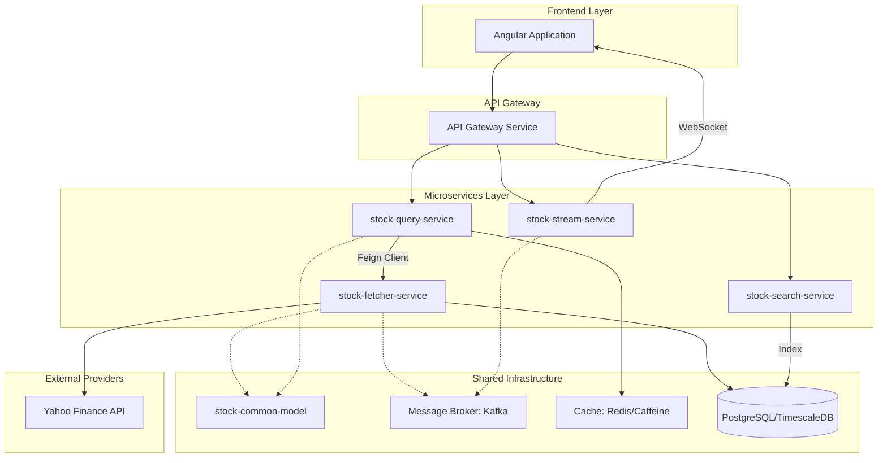

# Stock Market Microservices Roadmap

This document outlines the architecture, implementation details, and future milestones for the Stock Market Pulse project.

## 1. Architectural Overview

The project follows a **Microservices Architecture** designed for scalability, high availability, and real-time data processing. It leverages a CQRS-inspired pattern to separate data ingestion (Write) from data presentation (Read).

### Visual Architecture Diagram

---

## 2. Service Implementation Details

### A. `stock-fetcher-service` (Ingestion Layer)
*   **Role**: Primary adapter for external data sources.
*   **Key Features**:
    *   Excel-based symbol ingestion (`SymbolIngestionService`).
    *   Yahoo Finance API integration via `ExternalMarketClient`.
    *   Persistence of symbol metadata and historical details in PostgreSQL.
    *   Internal "System APIs" for other microservices.
*   **Status**: ✅ **Implemented** (Basic fetching and DB storage).

### B. `stock-query-service` (Read/View Layer)
*   **Role**: Public API provider for the Angular UI.
*   **Key Features**:
    *   Decouples UI from the ingestion logic.
    *   Aggregates data from `stock-fetcher-service`.
    *   Caching layer to reduce external API pressure.
    *   Versioned endpoints (`/api/v1/stocks/**`).
*   **Status**: ✅ **Implemented** (Feign integration and Caching).

### C. `stock-search-service` (Discovery Layer)
*   **Role**: Handles fast search and filtering.
*   **Planned Features**:
    *   Optimized search index (Elasticsearch or specialized DB view).
    *   Type-ahead search results.
    *   Filtering by Sector, Industry, and Exchange.
*   **Status**: ⏳ **Pending**.

### D. `stock-stream-service` (Real-time Layer)
*   **Role**: Pushes live updates to clients.
*   **Planned Features**:
    *   WebSocket/SSE connections.
    *   Real-time price alerts.
    *   Market movers live updates.
*   **Status**: ⏳ **Pending**.

### E. `stock-common-model` (Shared Library)
*   **Role**: Shared DTOs, Enums, and Utility classes to ensure consistency across services.
*   **Status**: ✅ **Implemented**.

---

## 3. Data Flow Strategy

1.  **Ingestion**: `stock-fetcher-service` reads symbols from Excel and fetches initial metadata from Yahoo Finance, saving it to the DB.
2.  **Requesting Data**: Angular UI calls `stock-query-service` for charts and summaries.
3.  **Aggregation & Caching**: `stock-query-service` checks its cache; if missing, it calls `stock-fetcher-service` via Feign.
4.  **Real-time Updates**: Once the initial page is loaded, the UI connects to `stock-stream-service` for live price "patches".

---

## 4. UI Implementation (Angular) - Next Steps

*   **Service Layer**: Create a `StockService` to consume `/api/v1/stocks` endpoints.
*   **Components**:
    *   `DashboardComponent`: Overview of market indices and movers.
    *   `StockDetailComponent`: Displays charts (Highcharts/Chart.js) and company summaries.
    *   `SearchComponent`: Global search for stocks.
*   **State Management**: Consider using NgRx or simple BehaviorSubjects for managing real-time price updates.

---

## 5. Technology Stack Summary

| Layer | Technology |
| :--- | :--- |
| **Backend** | Spring Boot 3.x, Java 17 |
| **Microservices** | Spring Cloud (OpenFeign, Gateway) |
| **Database** | PostgreSQL / TimescaleDB |
| **Messaging** | Apache Kafka |
| **Caching** | Redis / Caffeine |
| **Frontend** | Angular |
| **API Docs** | Swagger / OpenAPI |
